# NYC Taxi Trips — End-to-End Data Pipeline

A production-style batch data pipeline that ingests NYC TLC Yellow Taxi trip records,
models them into a star schema warehouse, and serves business KPIs via SQL transformations.
Orchestrated with Apache Airflow and validated with pytest.

---

## Architecture



**Ingestion → DuckDB Warehouse → SQL Transforms → KPI Layer**

| Layer         | Tool                  |
|---------------|-----------------------|
| Ingestion     | Python + requests     |
| Storage       | DuckDB                |
| Modeling      | Star Schema (Kimball) |
| Transforms    | SQL (window functions)|
| Orchestration | Apache Airflow        |
| Testing       | pytest                |

---

## Data Model

```
fact_trips ──► dim_vendor
     └──────► dim_location (pickup)
     └──────► dim_location (dropoff)
```

- **fact_trips**: ~3M rows/month of trip-level transactions
- **dim_location**: 265 NYC taxi zones
- **dim_vendor**: 2 licensed vendors

---

## Key SQL Patterns

### 7-Day Rolling Revenue Average
```sql
AVG(SUM(total_amount)) OVER (
    ORDER BY trip_date
    ROWS BETWEEN 6 PRECEDING AND CURRENT ROW
)
```

### Zone Revenue Ranking
```sql
RANK() OVER (ORDER BY total_revenue DESC)
```

---

## Pipeline DAG

```
ingest → load_warehouse → run_transforms
```

- Runs daily via Airflow `@daily` schedule
- 2 automatic retries with 5-min backoff on failure
- Idempotent: re-runs produce the same output

---

## Data Quality Checks

| Check | Rule |
|---|---|
| No negative fares | `fare_amount >= 0` |
| Minimum row count | `> 100,000 rows/month` |
| No null pickup timestamps | `pickup_datetime IS NOT NULL` |
| KPI table populated | `daily_kpis row count > 0` |

---

## How to Run

```bash
# 1. Clone and install
git clone https://github.com/yourusername/nyc-trips-pipeline.git
cd nyc-trips-pipeline
pip install -r requirements.txt

# 2. Ingest raw data
python ingest.py

# 3. Load warehouse
python warehouse.py

# 4. Run transformations
python run_transforms.py

# 5. Run tests
pytest tests/ -v

# 6. Start Airflow (optional)
airflow db init
airflow dags trigger nyc_trips_pipeline
```

---

## Sample Output

| trip_date  | total_trips | daily_revenue | revenue_7d_rolling_avg |
|------------|-------------|---------------|------------------------|
| 2024-01-01 | 84,231      | $1,243,560    | $1,243,560             |
| 2024-01-02 | 91,450      | $1,387,200    | $1,315,380             |
| 2024-01-07 | 96,100      | $1,521,000    | $1,398,420             |

---

## Design Decisions

**Why DuckDB?** Columnar, embedded, no server setup — ideal for analytical workloads
on a single machine. In production this maps to BigQuery or Redshift.

**Why star schema?** Optimized for analytical query patterns (aggregations, filters on
dimensions). Snowflake schema adds normalized dimension tables but increases join complexity.

**Why Airflow over cron?** Built-in retry logic, dependency management between tasks,
and DAG visualization — the same tooling used at scale in production.

---

## Scalability Path

| Current (Local) | Production Equivalent |
|---|---|
| DuckDB | BigQuery / Redshift |
| Local Airflow | Cloud Composer / MWAA |
| Batch only | + Kafka → Spark Streaming |
| Manual partitioning | Partition by `trip_date` on cloud DW |

---

## Dataset

[NYC TLC Trip Record Data](https://www.nyc.gov/site/tlc/about/tlc-trip-record-data.page) — Public domain, updated monthly.